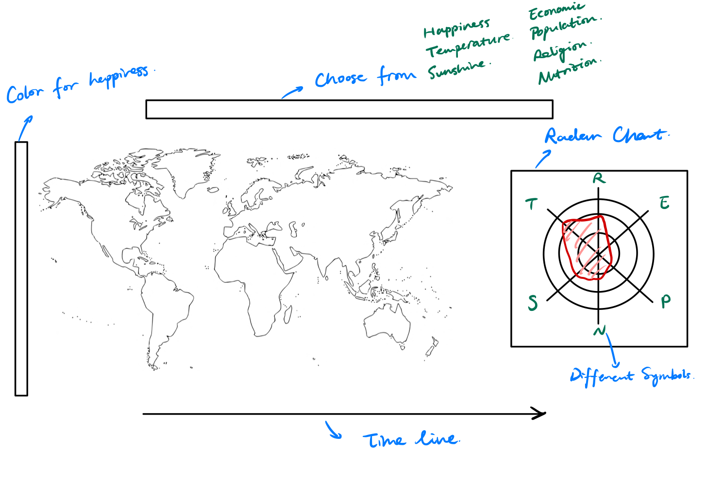
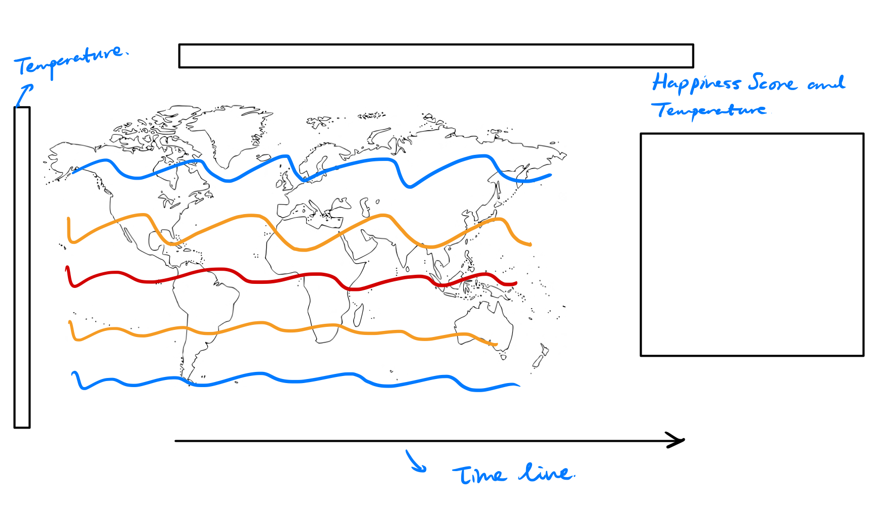
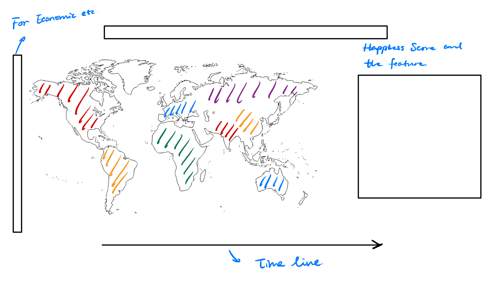
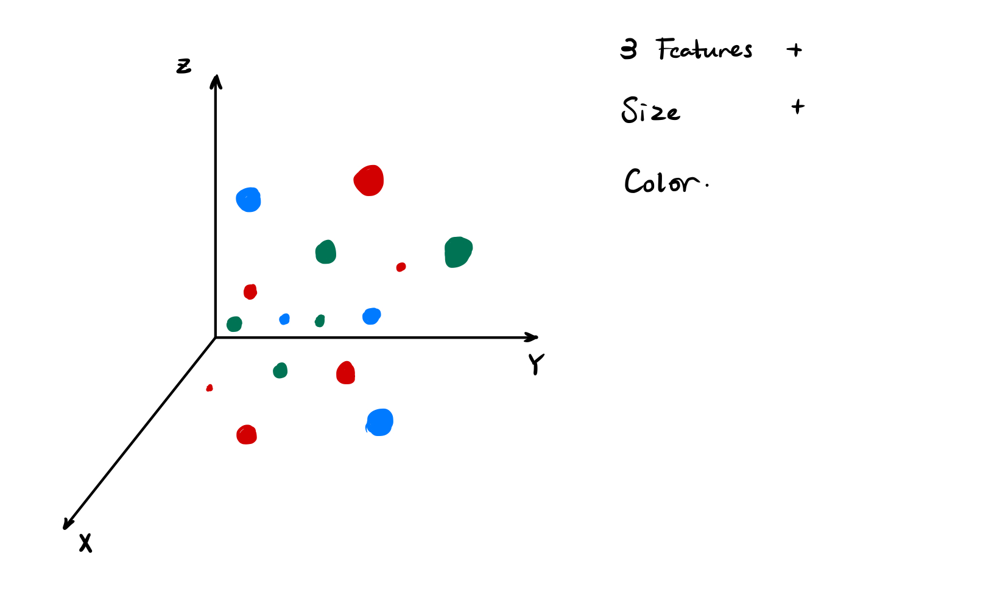
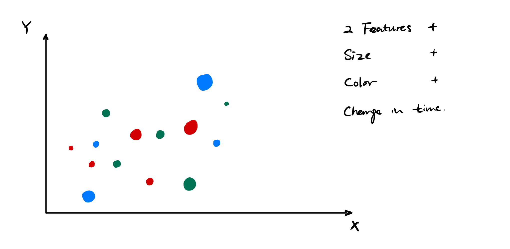
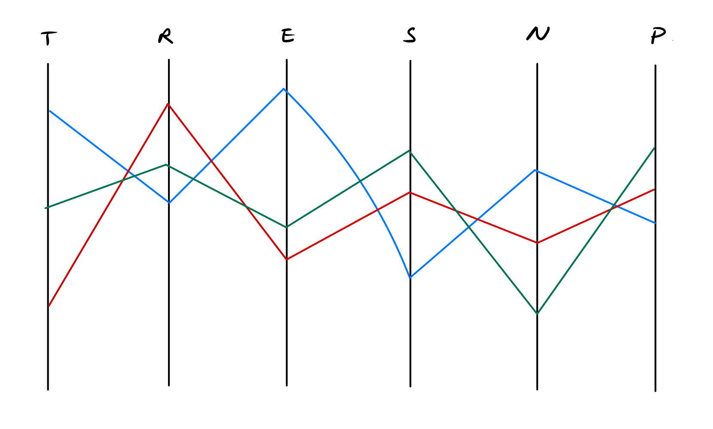

# 1. Sketches

### 1.1 General idea

The most significant visual element of our visualization is the world map. We would like to show the related information through different graphs with a world map in the center. A navigation bar is above the map for choosing different features, and a timeline is below the map for selecting years. Another window is on the right of the map to show the relative graphs and information.

### 1.2 Information on a map

The exhibit of happiness scores relies on different colors, and there is a color bar to show the extent of happiness. When one specific country or region is selected, a radar chart will show the variables that influence happiness scores.

 As to the variables, we will use two different types of visualizations. For weather-related variables, including temperature and sunshine, we will use contours to show them on the map. The relationship between the happiness score and the variable for one chosen country will be shown.

We will use a heat map to show the values for other variables.

For this part, we will use D3.js maps and lecture 8 on maps.

### 1.3 Relationships between variables

The relationship between different variables can be shown in three sets of visualizations. 

The first one is a 3D bubble plot. We can illustrate five different dimensions of information with three different features as the three axes and with varying sizes of dots and colors. 

The second one is an animation of a bubble plot. We can use the animation to show the change in the variables over time. 

Finally, it is insightful to use a parallel coordinates plot to show how the variables relate to each other.

For this part, we will use D3.js to draw the plots and create the animation. Lecture 11 on tabular data will be helpful.

# 2. Core visualization

We created a Jupyter notebook to illustrate what the visualizations will look like now. Please see the rendered HTML file [here](https://htmlpreview.github.io/?https://github.com/com-480-data-visualization/datavis-project-2022-msn/blob/main/Milestone2/core_visualization.html).
