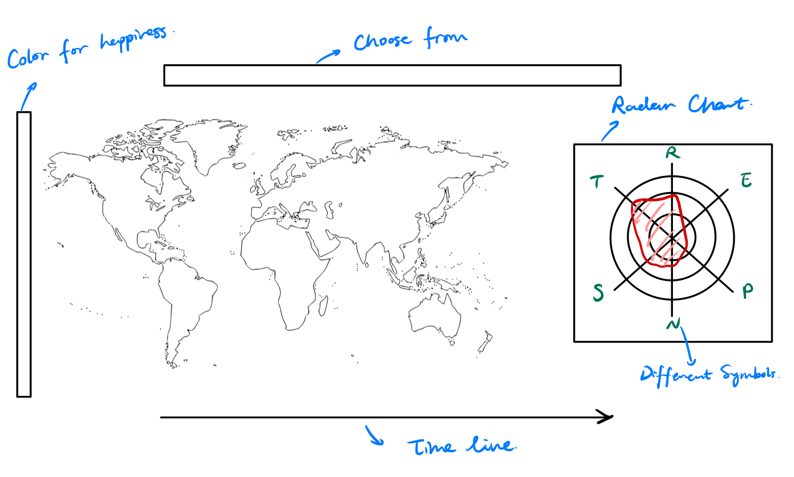
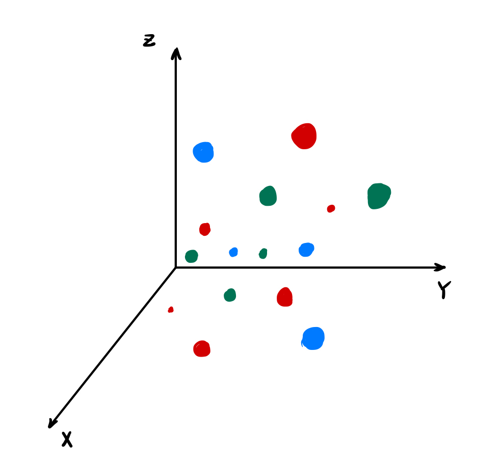

This is a map showing the "happiness" of each country through time.

{: .box-note}
**Note:** ou may chose to correlate happiness with any of the features listed above the map (e.g. money, weather, religion) by clicking their respective icon.

{: .mx-auto.d-block :}

Here's a summary of the interconnections between the different features

{: .mx-auto.d-block :}
